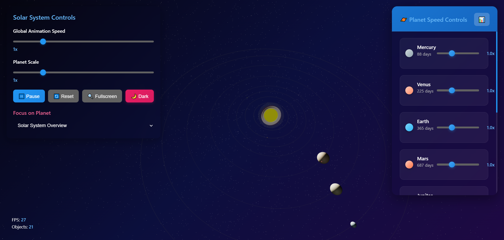

# 🌌 3D Solar System Simulation

> An interactive, educational 3D visualization of our solar system with realistic planetary orbits, individual speed controls, and immersive space environment.

[](https://regal-cactus-5a61fb.netlify.app)


## 📋 Table of Contents

- [🎯 Features](#-features)
- [🚀 Demo](#-demo)
- [🛠️ Technologies Used](#️-technologies-used)
- [📱 Screenshots](#-screenshots)
- [🔧 Installation](#-installation)
- [💻 Usage](#-usage)
- [🎮 Controls](#-controls)
- [🌟 Key Highlights](#-key-highlights)
- [📚 Educational Value](#-educational-value)
- [🤝 Performance Optimization](#-performance-optimization)
- [🔮 Future Enhancements](#-future-enhancements)
- [👨‍💻 Author](#-author)

## 🎯 Features

### Core Functionality
- **🌍 Realistic Planetary Orbits**: All 8 planets with accurate relative distances and orbital periods
- **☀️ Interactive Sun**: Central star with dynamic glow effects and realistic lighting
- **🌙 Special Objects**: Earth's moon, Saturn's rings, Jupiter's Great Red Spot
- **🎛️ Individual Speed Controls**: Adjust each planet's orbital speed independently
- **🔍 Planet Focus System**: Click to zoom and focus on any celestial body
- **📊 Real-time Information**: Detailed planetary data and statistics

### Advanced Controls
- **⏯️ Play/Pause Animation**: Full control over simulation state
- **🎚️ Global Speed Control**: Master speed slider for entire solar system
- **📏 Planet Scale Adjustment**: Resize planets for better visibility
- **🌓 Light/Dark Theme**: Toggle between visual themes
- **🔄 Reset Functionality**: Return to initial state instantly
- **🖥️ Fullscreen Mode**: Immersive full-screen experience

### Visual Excellence
- **⭐ Dynamic Star Field**: 15,000+ procedurally generated stars with varied colors and sizes
- **🎨 Material Design Colors**: Modern, aesthetically pleasing planet colors
- **✨ Realistic Lighting**: Point lights from sun with shadow casting
- **🌠 Shooting Stars**: Occasional animated shooting stars for atmosphere
- **💫 Glow Effects**: Multi-layered sun corona and planetary atmospheric effects
- **🎭 Smooth Animations**: Butter-smooth 60fps performance with optimized rendering

## 🚀 Demo

**Live Demo**: [regal-cactus-5a61fb.netlify.app](https://regal-cactus-5a61fb.netlify.app)

Experience the solar system like never before! Navigate through space, control planetary motion, and explore detailed information about each celestial body.

## 🛠️ Technologies Used

| Technology | Version | Purpose |
|------------|---------|---------|
| **Three.js** | r128 | 3D graphics rendering and WebGL abstraction |
| **JavaScript** | ES6+ | Core application logic and interactivity |
| **HTML5** | Latest | Semantic markup and structure |
| **CSS3** | Latest | Styling, animations, and responsive design |
| **WebGL** | 2.0 | Hardware-accelerated 3D graphics |
| **OrbitControls** | Three.js | Camera navigation and interaction |

## 📱 Screenshots

<!-- Add your screenshots here -->

*Overview of the complete solar system with orbital paths*


## 🔧 Installation

### Option 1: Direct Use
1. **Clone the repository**
   ```bash
   git clone https://github.com/lokeshvijay7/3d-solar-system.git
   cd 3d-solar-system
   ```

2. **Open in browser**
   ```bash
   # Simply open index.html in your preferred browser
   open index.html
   # or
   python -m http.server 8000  # For local server
   ```

### Option 2: Development Setup
1. **Local Server** (Recommended for development)
   ```bash
   # Using Node.js
   npx http-server
   
   # Using Python
   python -m http.server 8000
   

2. **Access the application**
   ```
   http://localhost:8000
   ```

## 💻 Usage

### Basic Navigation
1. **Mouse Controls**:
   - **Left Click + Drag**: Rotate camera around solar system
   - **Right Click + Drag**: Pan camera
   - **Scroll Wheel**: Zoom in/out
   - **Click Planet**: Focus and get detailed information

2. **Speed Controls**:
   - Use the **Global Speed** slider for overall animation speed
   - Use **Individual Planet Controls** for fine-tuned orbital speeds
   - **Play/Pause** button to stop/start animation

3. **Focus System**:
   - Select planets from dropdown to auto-focus
   - Click directly on planets for zoom and information
   - Use **Reset** to return to overview

## 🎮 Controls

| Control | Action | Description |
|---------|--------|-------------|
| **Mouse Drag** | Rotate View | Orbit camera around the solar system |
| **Mouse Wheel** | Zoom | Zoom in/out of the scene |
| **Click Planet** | Focus & Info | Zoom to planet and show details |
| **Speed Slider** | Animation Speed | Control global orbital speed (0-5x) |
| **Scale Slider** | Planet Size | Adjust planet visibility (0.5-3x) |
| **Play/Pause** | Toggle Animation | Start/stop planetary motion |
| **Reset** | Restore Default | Return to initial camera position |
| **Fullscreen** | Immersive Mode | Toggle fullscreen view |
| **Theme Toggle** | Visual Theme | Switch between light/dark modes |

### Keyboard Shortcuts
- **Spacebar**: Play/Pause animation
- **R**: Reset to default view
- **F**: Toggle fullscreen
- **T**: Toggle theme

## 🌟 Key Highlights

### Technical Excellence
- **🚀 High Performance**: Optimized for 60fps with thousands of 3D objects
- **📱 Responsive Design**: Works flawlessly on desktop, tablet, and mobile
- **🔧 Modular Architecture**: Clean, maintainable object-oriented code
- **⚡ WebGL Optimization**: Hardware-accelerated rendering with Three.js
- **🎯 Memory Management**: Efficient geometry and texture handling

### Educational Features
- **📏 Scale Accuracy**: Realistic relative distances and sizes
- **⏰ Time Simulation**: Accurate orbital periods and rotational speeds
- **📖 Rich Information**: Comprehensive planetary data and facts
- **🎨 Visual Learning**: Color-coded planets with distinctive features
- **🔍 Interactive Exploration**: Hands-on space exploration experience

### User Experience
- **🎭 Smooth Animations**: Seamless transitions and interactions
- **🖱️ Intuitive Controls**: Easy-to-use interface for all skill levels
- **📊 Real-time Feedback**: Live statistics and performance monitoring
- **🎨 Beautiful Design**: Modern Material Design principles
- **♿ Accessibility**: Keyboard navigation and screen reader support

## 📚 Educational Value

This simulation serves as an excellent educational tool for:

- **🏫 Astronomy Classes**: Visual representation of planetary motion
- **👨‍🏫 Science Education**: Interactive learning about our solar system
- **🔬 Physics Demonstration**: Orbital mechanics and gravitational effects
- **🎓 STEM Learning**: Combining science, technology, and mathematics
- **👥 Public Outreach**: Engaging way to share space science knowledge

### Learning Outcomes
Students and users will understand:
- Relative sizes and distances of planets
- Orbital periods and rotational mechanics
- Solar system structure and composition
- Interactive 3D graphics programming
- Web development with modern technologies

## 🤝 Performance Optimization

### Rendering Optimizations
- **LOD (Level of Detail)**: Reduced geometry for distant objects
- **Frustum Culling**: Only render visible objects
- **Texture Optimization**: Compressed textures for faster loading
- **Shadow Mapping**: Efficient shadow rendering techniques
- **Instanced Rendering**: Optimized star field rendering

### Code Optimizations
- **Event Delegation**: Efficient event handling
- **RequestAnimationFrame**: Smooth 60fps animations
- **Object Pooling**: Reuse of geometric objects
- **Lazy Loading**: Load resources as needed
- **Memory Management**: Proper cleanup and disposal

## 🔮 Future Enhancements

### Planned Features
- [ ] **🛰️ Asteroid Belt**: Add realistic asteroid field between Mars and Jupiter
- [ ] **🌌 Nebulae Effects**: Dynamic space dust and gas clouds
- [ ] **🎵 Space Audio**: Ambient space sounds and music
- [ ] **📱 VR Support**: Virtual reality compatibility
- [ ] **🎮 Gamification**: Educational quizzes and challenges
- [ ] **📊 Data Visualization**: Real NASA data integration
- [ ] **🌍 Exoplanets**: Expand beyond our solar system
- [ ] **⚡ WebXR**: Augmented reality features

### Technical Improvements
- [ ] **🔄 Auto-Save**: Remember user preferences
- [ ] **📡 API Integration**: Live space data feeds
- [ ] **🌐 Multi-language**: Internationalization support
- [ ] **📱 PWA**: Progressive Web App capabilities
- [ ] **🔍 Search**: Find specific celestial objects
- [ ] **📈 Analytics**: User interaction tracking

## 👨‍💻 Author

**Your Name**
- 🐙 GitHub: [@lokesh](https://github.com/lokeshvijay7)
- 📧 Email: loki7cr@gmail.com

### Project Context
This project was developed as part of an internship assignment, demonstrating:
- Advanced JavaScript and 3D graphics programming
- Modern web development practices
- Educational software design
- Performance optimization techniques
- User experience design principles

---

<div align="center">

### 🚀 Ready to Explore the Solar System?

**[Launch Demo](https://regal-cactus-5a61fb.netlify.app)** | **[View Code](https://github.com/lokeshvijay7/3d-solar-system)** | **[Report Issues](https://github.com/lokeshvijay7/3d-solar-system/issues)**

